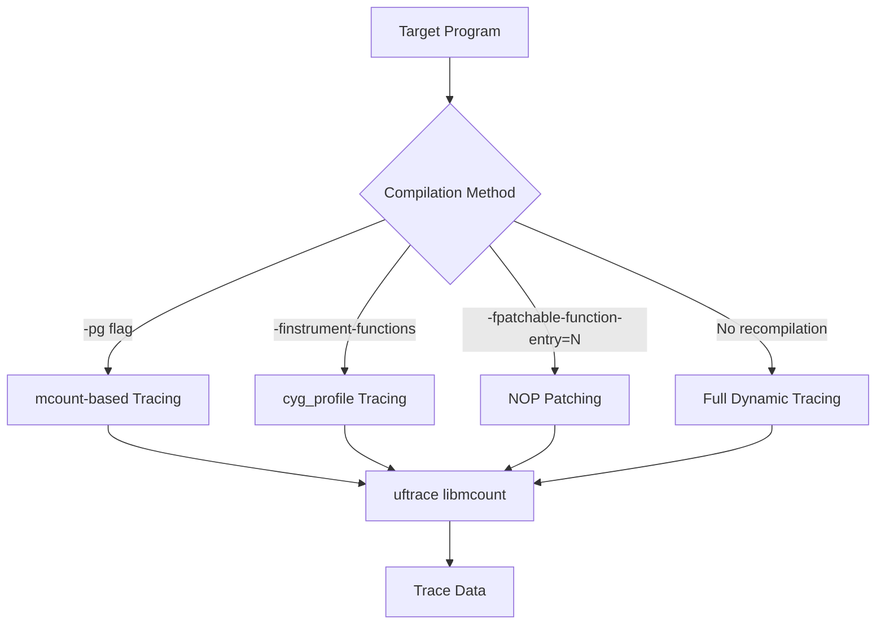
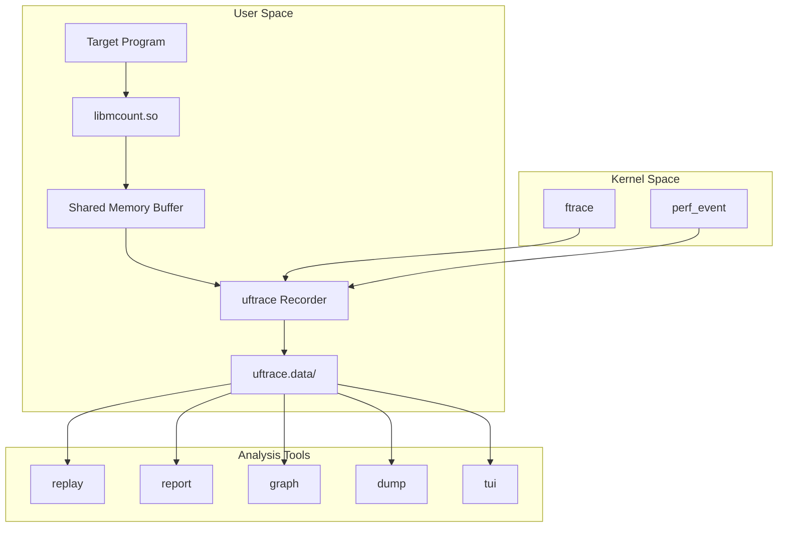
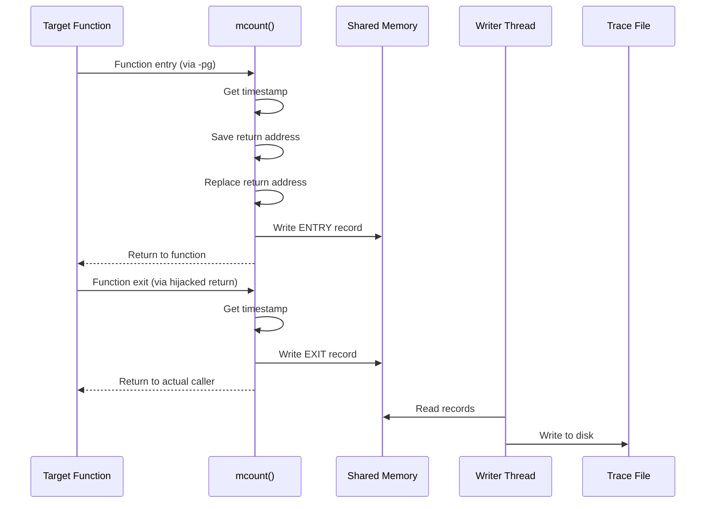

# uftrace Project Documentation

## Table of Contents
1. [Overview](#overview)
2. [Key Features](#key-features)
3. [Installation](#installation)
4. [How to Use](#how-to-use)
5. [Architecture](#architecture)
6. [Core Components](#core-components)
7. [Function Implementation Details](#function-implementation-details)

---

## Overview

**uftrace** is a high-performance function call graph tracer for **C, C++, Rust, and Python** programs. It hooks into function entry and exit points to record timestamps, arguments, and return values, providing detailed execution flow analysis.

The name "uftrace" comes from **"user ftrace"**, as it was heavily inspired by the Linux kernel's ftrace framework but designed for userspace applications.

### What It Does

uftrace can trace and record:

| Source | Description |
|--------|-------------|
| User functions | C/C++/Rust functions via `-pg`, `-finstrument-functions`, or dynamic patching |
| Library calls | Functions in shared libraries through PLT (Procedure Linkage Table) hooking |
| Python functions | Using Python's trace/profile infrastructure |
| Kernel functions | Via Linux ftrace framework (requires root) |
| Kernel events | Using event tracing framework |
| Scheduling events | Task creation, termination, and scheduling via perf_event |
| User events | Using SystemTap SDT ABI |
| PMU counters | Hardware performance counters via perf_event |

With recorded data, uftrace provides:
- Colored, nested function call graphs
- Argument and return value display (using DWARF debug info)
- Performance statistics and reports
- Visualization via Chrome trace viewer, flame graphs, Graphviz, and Mermaid
- Text-based UI (TUI) for interactive analysis

---

## Key Features

### 1. Multiple Tracing Methods



### 2. Filtering Capabilities

- **Function filters** (`-F`, `-N`): Include or exclude specific functions
- **Depth filter** (`-D`): Limit call stack depth
- **Time filter** (`-t`): Show only functions exceeding threshold
- **Size filter** (`-Z`): Filter by function binary size
- **Caller filter** (`-C`): Focus on callers of specific functions
- **Location filter** (`-L`): Filter by source file location

### 3. Visualization Outputs

- **Live replay**: Real-time colored output with nested call graphs
- **Chrome trace format**: JSON export for Chrome's trace viewer
- **Flame graphs**: Suitable for flamegraph.pl processing
- **Graphviz/Mermaid**: Call graph diagrams

### 4. Cross-Platform Support

| Architecture | Full Support | Dynamic Tracing |
|-------------|--------------|-----------------|
| x86_64 | ✅ | ✅ |
| AArch64 | ✅ | ✅ |
| x86 (32-bit) | ✅ | Limited |
| ARM (v6/v7) | ✅ | Limited |
| RISC-V 64 | ✅ | ✅ |

---

## Installation

### Quick Install

```bash
# Install dependencies (optional but recommended)
$ sudo misc/install-deps.sh

# Configure
$ ./configure --prefix=/usr

# Build and install
$ make
$ sudo make install
```

### Dependencies

| Package | Purpose | Required |
|---------|---------|----------|
| libdw/libelf | ELF/DWARF handling | Recommended |
| libstdc++ | Full C++ symbol demangling | Optional |
| libncursesw | TUI support | Optional |
| capstone | Full dynamic tracing | Optional |
| libpython | Python scripting | Optional |
| libluajit | LuaJIT scripting | Optional |
| pandoc | Man page generation | Optional |

### Building Options

```bash
# Configure with specific features
./configure --prefix=/usr \
            --without-libpython \  # Disable Python support
            --arch=aarch64         # Cross-compile for ARM64
```

---

## How to Use

### Basic Commands

uftrace provides 10 main commands:

| Command | Description |
|---------|-------------|
| `record` | Run a program and save trace data |
| `replay` | Display recorded execution trace |
| `report` | Show performance statistics |
| `live` | Record and replay in one step (default) |
| `info` | Display system/program info from trace |
| `dump` | Show low-level trace data |
| `recv` | Receive trace data over network |
| `graph` | Display function call graph |
| `script` | Run custom scripts on trace data |
| `tui` | Interactive text UI for analysis |

### Usage Examples

#### Basic Tracing

```bash
# Simple live tracing
$ uftrace ./myprogram

# Record for later analysis
$ uftrace record ./myprogram
$ uftrace replay
```

#### With Filters

```bash
# Trace only function 'main' and its callees
$ uftrace -F main ./myprogram

# Exclude specific function
$ uftrace -N expensive_function ./myprogram

# Limit to 3 levels deep
$ uftrace -D 3 ./myprogram

# Show only functions taking > 10µs
$ uftrace -t 10us ./myprogram
```

#### Recording Arguments and Return Values

```bash
# Automatic argument recording
$ uftrace -a ./myprogram

# Manual specification
$ uftrace -A puts@arg1/s -R puts@retval ./hello

# Example output:
#    7.226 us [21534] |   puts("Hello world") = 12;
```

#### Dynamic Tracing (without recompilation)

```bash
# Trace specific function dynamically
$ uftrace -P main --no-libcall ./unmodified_binary

# Trace all functions dynamically
$ uftrace -P . ./unmodified_binary
```

#### Kernel Tracing

```bash
# Trace user + kernel functions (requires root)
$ sudo uftrace -k ./myprogram
```

#### Visualization

```bash
# Generate Chrome trace format
$ uftrace dump --chrome > trace.json

# Generate flame graph data
$ uftrace dump --flame-graph | flamegraph.pl > flame.svg

# Generate Graphviz diagram
$ uftrace graph --graphviz | dot -Tpng -o callgraph.png
```

---

## Architecture

### High-Level Architecture



### Directory Structure

```
uftrace/
├── uftrace.c          # Main entry point, command parsing
├── uftrace.h          # Core data structures and APIs
├── cmds/              # Command implementations
│   ├── record.c       # 'record' command
│   ├── replay.c       # 'replay' command
│   ├── report.c       # 'report' command
│   ├── graph.c        # 'graph' command
│   ├── dump.c         # 'dump' command
│   ├── info.c         # 'info' command
│   ├── live.c         # 'live' command
│   ├── recv.c         # 'recv' command
│   ├── script.c       # 'script' command
│   └── tui.c          # 'tui' command
├── libmcount/         # Tracing library (injected into target)
│   ├── mcount.c       # Core mcount implementation
│   ├── plthook.c      # PLT hooking for library calls
│   ├── dynamic.c      # Dynamic patching engine
│   ├── record.c       # Trace data recording
│   ├── wrap.c         # Function wrapper implementations
│   ├── event.c        # Event handling
│   └── agent.c        # Runtime agent for live control
├── utils/             # Utility modules
│   ├── symbol.c       # Symbol table management
│   ├── filter.c       # Filter/trigger processing
│   ├── fstack.c       # Function stack handling
│   ├── dwarf.c        # DWARF debug info parsing
│   ├── demangle.c     # Symbol demangling
│   ├── kernel.c       # Kernel tracing support
│   ├── perf.c         # perf_event support
│   ├── script.c       # Script execution framework
│   ├── session.c      # Session management
│   ├── report.c       # Report generation
│   └── graph.c        # Graph data structures
├── arch/              # Architecture-specific code
│   ├── x86_64/        # x86-64 implementation
│   ├── aarch64/       # ARM64 implementation
│   ├── arm/           # ARM 32-bit
│   ├── i386/          # x86 32-bit
│   └── riscv64/       # RISC-V 64-bit
├── scripts/           # Analysis scripts
├── tests/             # Test suite
└── doc/               # Documentation
```

---

## Core Components

### 1. Main Entry (`uftrace.c`)

The main entry point handles:
- Command-line argument parsing
- Default options handling
- Command dispatch to appropriate handlers

```c
// Key command handlers
int command_record(int argc, char *argv[], struct uftrace_opts *opts);
int command_replay(int argc, char *argv[], struct uftrace_opts *opts);
int command_live(int argc, char *argv[], struct uftrace_opts *opts);
int command_report(int argc, char *argv[], struct uftrace_opts *opts);
// ... etc
```

### 2. Tracing Library (`libmcount/`)

This shared library is injected into the target process via `LD_PRELOAD`.

#### mcount.c - Core Tracing

Implements the `mcount()` function that gets called at each function entry when compiled with `-pg`:

```c
// Key functions
void mcount_entry(unsigned long *parent_loc, unsigned long child,
                  struct mcount_regs *regs);
unsigned long mcount_exit(long *retval);
```

**Data flow:**
1. Function entry → `mcount_entry()` records timestamp and arguments
2. Return address is replaced to intercept exit
3. Function exit → `mcount_exit()` records duration and return value
4. Data written to shared memory buffer

#### plthook.c - PLT Hooking

Intercepts library function calls by modifying the PLT/GOT:

```c
// PLT resolver replacement
unsigned long __plthook_entry(unsigned long *ret_addr, 
                              unsigned long child_idx,
                              unsigned long module_id, 
                              struct mcount_regs *regs);
```

**Mechanism:**
1. Overwrites PLT entries to redirect to uftrace resolver
2. Records library call entry/exit
3. Resolves actual function address and jumps to it

#### dynamic.c - Dynamic Patching

Enables tracing without recompilation:

```c
// Dynamic tracing setup
int mcount_dynamic_update(struct uftrace_sym_info *sinfo, 
                          char *patch_funcs,
                          enum uftrace_pattern_type ptype);
```

**Technique:**
1. Analyzes function prologues using capstone disassembler
2. Copies original instructions to safe location
3. Inserts call to mcount trampoline
4. Restores original execution flow after recording

### 3. Commands (`cmds/`)

#### record.c

Manages the recording process:
- Forks target process with `LD_PRELOAD`
- Sets up shared memory communication
- Spawns writer threads to save data
- Handles kernel/perf event tracing

```c
// Key structures
struct writer_arg {
    struct list_head list;
    struct list_head bufs;
    struct uftrace_opts *opts;
    struct uftrace_kernel_writer *kern;
    struct uftrace_perf_writer *perf;
    int sock;
    // ...
};
```

#### replay.c

Reads and displays recorded trace data:

```c
int print_graph_rstack(struct uftrace_data *handle, 
                       struct uftrace_task_reader *task,
                       struct uftrace_opts *opts);
```

Produces formatted output like:
```
# DURATION    TID     FUNCTION
             [1234] | main() {
             [1234] |   a() {
   5.475 us [1234] |     b();
   6.448 us [1234] |   } /* a */
   8.631 us [1234] | } /* main */
```

#### report.c

Generates performance statistics:

```c
void build_function_tree(struct uftrace_data *handle, 
                         struct rb_root *root,
                         struct uftrace_opts *opts);
```

Aggregates timing data and produces reports sorted by total time, self time, or call count.

### 4. Utilities (`utils/`)

#### symbol.c - Symbol Management

```c
// Load symbol tables from ELF
int load_symtab(struct uftrace_symtab *symtab, 
                const char *filename,
                unsigned long long offset, 
                unsigned long flags);

// Find symbol by address
struct uftrace_symbol *find_symtab(struct uftrace_symtab *symtab, 
                                   uint64_t addr);
```

#### filter.c - Filter Processing

```c
// Match address against filter tree
struct uftrace_filter *uftrace_match_filter(uint64_t addr, 
                                            struct uftrace_triggers_info *filters,
                                            struct uftrace_trigger *tr);

// Parse filter/trigger specifications
int uftrace_setup_filter(char *filter_str, 
                         struct uftrace_filter_setting *setting,
                         struct uftrace_triggers_info *info);
```

#### dwarf.c - Debug Info Processing

```c
// Load DWARF debug information
int load_debug_info(struct uftrace_dbg_info *dinfo, 
                    const char *filename);

// Get argument types from debug info
struct list_head *get_dwarf_argspec(struct uftrace_dbg_info *dinfo,
                                    const char *funcname);
```

---

## Function Implementation Details

### Tracing Flow



### Key Data Structures

#### uftrace_record

The fundamental trace record structure:

```c
struct uftrace_record {
    uint64_t time;          // Timestamp in nanoseconds
    uint64_t type : 2;      // ENTRY, EXIT, LOST, or EVENT
    uint64_t more : 1;      // Has additional data (args)
    uint64_t magic : 3;     // Magic number for validation
    uint64_t depth : 10;    // Call stack depth
    uint64_t addr : 48;     // Function address or event ID
};
```

#### uftrace_opts

Command-line options and configuration:

```c
struct uftrace_opts {
    char *filter;           // Function filter string
    char *trigger;          // Trigger specification
    char *dirname;          // Data directory
    int depth;              // Max depth filter
    uint64_t threshold;     // Time threshold (ns)
    bool kernel;            // Enable kernel tracing
    bool auto_args;         // Auto record arguments
    bool nest_libcall;      // Trace nested library calls
    // ... many more options
};
```

#### uftrace_session

Session management for multi-process tracing:

```c
struct uftrace_session {
    struct rb_node node;
    char sid[16];           // Session ID
    uint64_t start_time;
    int pid, tid;
    struct uftrace_sym_info sym_info;
    struct uftrace_triggers_info filter_info;
    char exename[];
};
```

### Filter Implementation

Filters are stored in an RB-tree for efficient lookup:

```c
struct uftrace_filter {
    struct rb_node node;
    char *name;
    uint64_t start;         // Start address
    uint64_t end;           // End address
    struct uftrace_trigger trigger;
};
```

The trigger contains all filtering/action data:

```c
struct uftrace_trigger {
    unsigned long flags;    // TRIGGER_FL_* flags
    int depth;              // Depth action value
    uint64_t time;          // Time filter value
    unsigned size;          // Size filter value
    enum trigger_read_type read;
    struct list_head args;  // Argument specs
    struct list_head ret;   // Return value specs
};
```

### Dynamic Tracing Implementation

For x86_64, dynamic tracing works by:

1. **Detection**: Analyze function prologue instructions
2. **Preparation**: Allocate executable memory for trampolines
3. **Patching**: Replace prologue with `call mcount` (5 bytes on x86_64)
4. **Execution**: When function is called, mcount runs first
5. **Continuation**: Original instructions execute from copied location

```c
// From arch/x86_64/mcount-dynamic.c
void mcount_save_code(struct mcount_disasm_info *info,
                      unsigned call_size,
                      void *jmp_insn,
                      unsigned jmp_size);
```

### PLT Hooking Mechanism

The PLT (Procedure Linkage Table) hooking intercepts library calls:

1. **Setup**: Find all PLT entries and their GOT slots
2. **Hook**: Replace GOT entries with uftrace resolver
3. **Intercept**: When PLT is called, our resolver runs
4. **Record**: Log the library call entry
5. **Resolve**: Call the actual function
6. **Exit**: Log the return

---

## Limitations

- Cannot trace already running processes
- Not designed for system-wide tracing
- Dynamic tracing limited on 32-bit architectures
- Python tracing has its own overhead
- Some functions (setjmp/longjmp, exceptions) may cause issues

---

## License

uftrace is released under **GPL v2**. See the [COPYING](file:///home/ubuntu/work/uftrace/COPYING) file for details.

---

## Additional Resources

- **Homepage**: https://github.com/namhyung/uftrace
- **Tutorial**: https://github.com/namhyung/uftrace/wiki/Tutorial
- **Discord**: https://discord.gg/MENMKaCWqD
- **Mailing List**: uftrace@googlegroups.com
