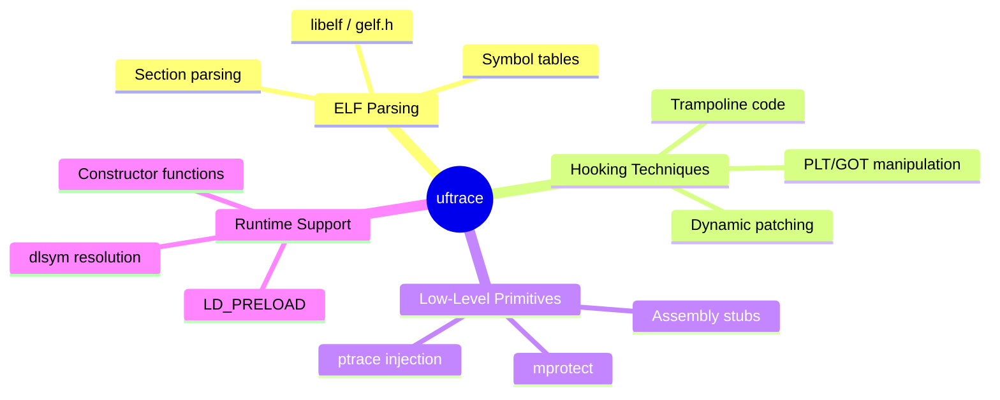
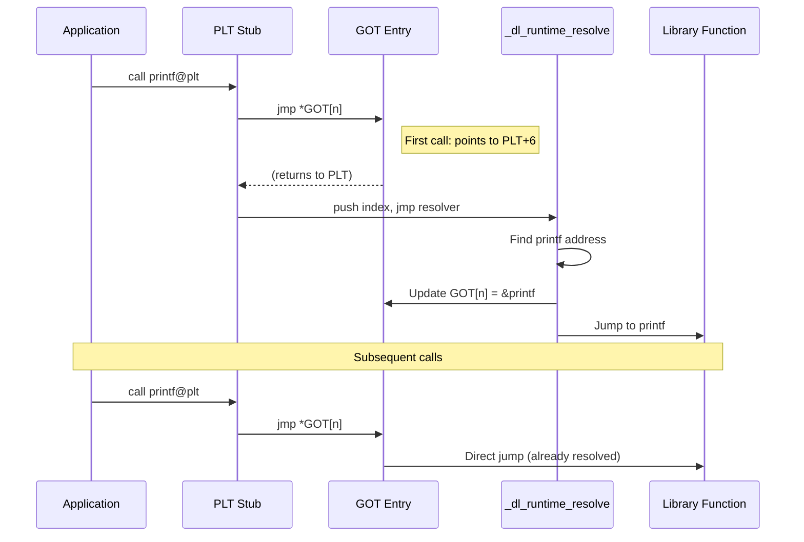
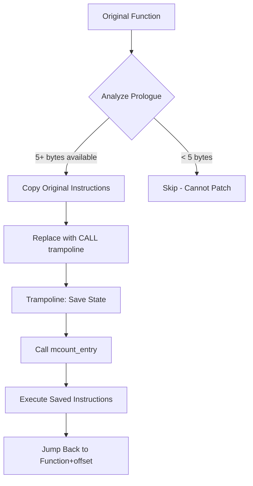
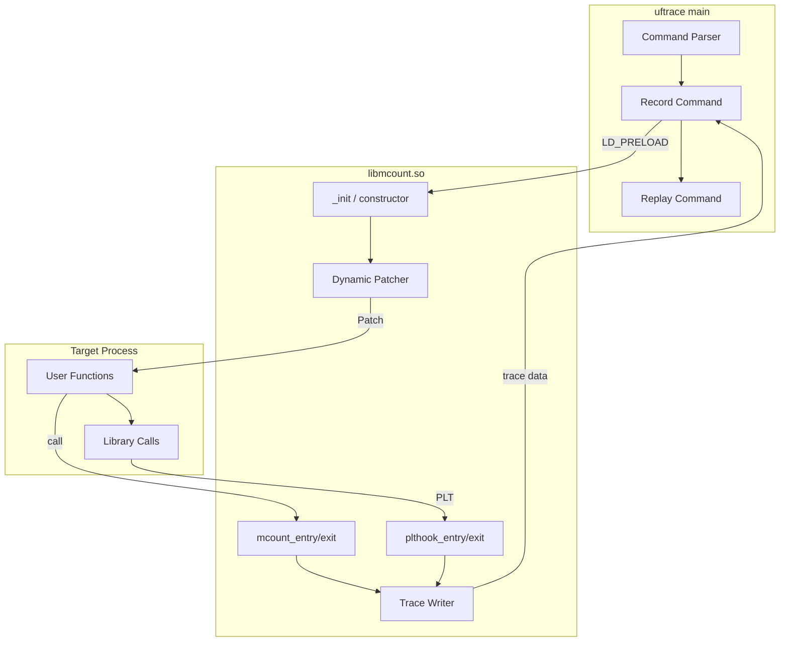
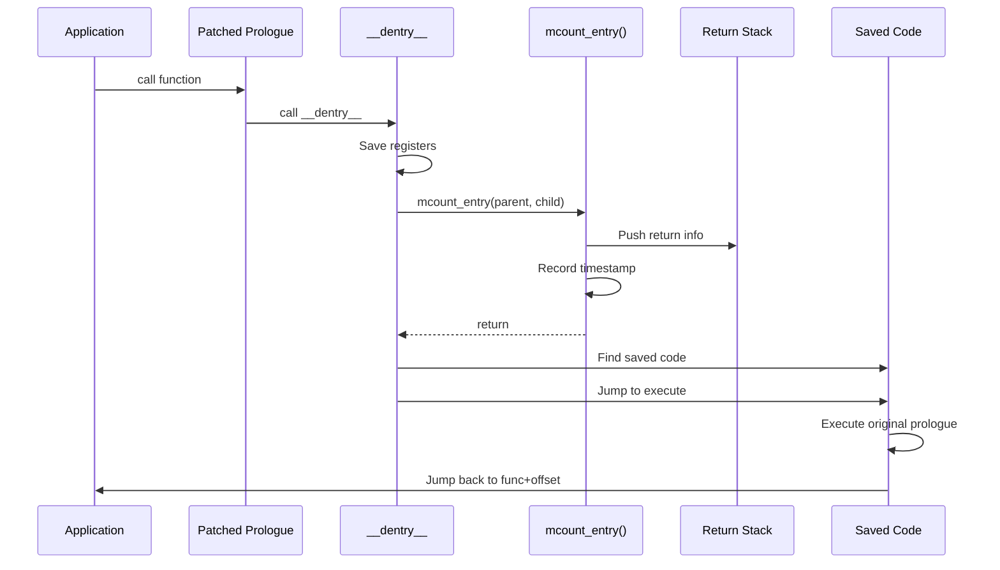

# uftrace Project Analysis for Freshmen

A comprehensive guide to understanding the uftrace function call graph tracer.

---

## Table of Contents
1. [What is uftrace?](#1-what-is-uftrace)
2. [Key Technologies and Concepts](#2-key-technologies-and-concepts)
3. [ELF Format Fundamentals](#3-elf-format-fundamentals)
4. [Linux Shared Libraries](#4-linux-shared-libraries)
5. [PLT and GOT Hooking](#5-plt-and-got-hooking)
6. [Dynamic Patching and Trampolines](#6-dynamic-patching-and-trampolines)
7. [Project Architecture](#7-project-architecture)
8. [Code Walkthrough](#8-code-walkthrough)

---

## 1. What is uftrace?

**uftrace** is a function call graph tracer for C, C++, Rust, and Python programs. It records:
- **Function entry and exit times** with nanosecond precision
- **Function arguments and return values**
- **User-space and kernel function calls**
- **Library function calls** via PLT hooking

```
# Example output
# DURATION    TID     FUNCTION
             [ 1892] | main() {
             [ 1892] |   a() {
             [ 1892] |     b() {
             [ 1892] |       c() {
    2.579 us [ 1892] |         getpid();
    3.739 us [ 1892] |       } /* c */
    4.376 us [ 1892] |     } /* b */
    4.962 us [ 1892] |   } /* a */
    5.769 us [ 1892] | } /* main */
```

### Key Features
| Feature | Description |
|---------|-------------|
| **Dynamic Tracing** | Trace without recompilation using `-P.` |
| **PLT Hooking** | Intercept library calls automatically |
| **Kernel Tracing** | Trace kernel functions with `-k` |
| **Multi-arch** | x86_64, AArch64, ARM, i386, RISC-V |

---

## 2. Key Technologies and Concepts

### Technologies Used



### Core Concepts

| Concept | Purpose |
|---------|---------|
| **mcount** | Compiler-inserted function call hook |
| **PLT/GOT** | Lazy binding mechanism for shared libraries |
| **Trampoline** | Intermediate code that redirects execution |
| **Dynamic Patching** | Modifying instructions at runtime |

---

## 3. ELF Format Fundamentals

ELF (Executable and Linkable Format) is the standard binary format for Linux executables and shared libraries.

### ELF Structure Overview

```
┌─────────────────────────────┐
│       ELF Header            │  ← Magic number, architecture, entry point
├─────────────────────────────┤
│    Program Headers          │  ← How to load into memory (segments)
├─────────────────────────────┤
│                             │
│    .text (code)             │
│    .rodata (constants)      │
│    .data (initialized data) │
│    .bss (uninitialized)     │
│    .plt (procedure linkage) │
│    .got (global offset)     │
│    .symtab (symbols)        │
│    .dynsym (dynamic syms)   │
│    ...                      │
│                             │
├─────────────────────────────┤
│    Section Headers          │  ← Metadata about sections
└─────────────────────────────┘
```

### Key ELF Sections for uftrace

| Section | Purpose |
|---------|---------|
| `.text` | Executable code - where functions live |
| `.plt` | PLT stubs for lazy symbol resolution |
| `.got.plt` | GOT entries storing resolved addresses |
| `.dynsym` | Dynamic symbol table for shared libraries |
| `.rela.plt` | Relocation entries for PLT |
| `__mcount_loc` | Addresses of mcount call sites (for `-pg`) |
| `__patchable_function_entries` | Patchable NOP locations |

### uftrace ELF Parsing

uftrace uses **libelf (gelf.h)** to parse ELF files:

```c
// From utils/symbol-libelf.h
struct uftrace_elf_data {
    int fd;
    Elf *handle;
    GElf_Ehdr ehdr;     // ELF header
};

struct uftrace_elf_iter {
    GElf_Phdr phdr;     // Program header
    GElf_Shdr shdr;     // Section header
    GElf_Sym sym;       // Symbol entry
    GElf_Rela rela;     // Relocation entry
    // ...
};
```

**Iteration macros** simplify ELF traversal:
```c
elf_for_each_shdr(elf, iter)   // Iterate section headers
elf_for_each_symbol(elf, iter) // Iterate symbols
elf_for_each_dynamic(elf, iter) // Iterate dynamic entries
```

---

## 4. Linux Shared Libraries

### How Dynamic Linking Works

When a program calls a library function like `printf()`:

```
1. Compile Time: Linker creates PLT/GOT entries
2. Load Time: Dynamic linker (ld-linux.so) maps libraries
3. First Call: Lazy binding resolves actual address
4. Later Calls: Direct jump via GOT
```



### PLT Entry Structure (x86_64)

```asm
# PLT stub for printf
printf@plt:
    jmp    *GOT[printf]      # 6 bytes: ff 25 XX XX XX XX
    push   $index            # Push relocation index
    jmp    PLT[0]            # Jump to resolver stub
```

### GOT Structure

```
GOT[0]: _DYNAMIC pointer
GOT[1]: link_map pointer
GOT[2]: _dl_runtime_resolve address  ← uftrace replaces this!
GOT[3]: First PLT entry target
GOT[4]: Second PLT entry target
...
```

---

## 5. PLT and GOT Hooking

### How uftrace Hooks Library Calls

uftrace intercepts ALL library calls by replacing GOT[2] (the resolver address):

```
Before uftrace:
┌─────────────┐     ┌─────────────┐
│ PLT stub    │────▶│ GOT[2]      │────▶ _dl_runtime_resolve
└─────────────┘     └─────────────┘

After uftrace:
┌─────────────┐     ┌─────────────┐
│ PLT stub    │────▶│ GOT[2]      │────▶ plt_hooker (uftrace)
└─────────────┘     └─────────────┘
                                          │
                                          ▼
                                    Record entry
                                          │
                                          ▼
                                    Call original
                                          │
                                          ▼
                                    Record exit
```

### Implementation: [plthook.c](file:///home/ubuntu/work/uftrace/libmcount/plthook.c)

```c
// Key function: find_got()
// 1. Parse ELF to find PLTGOT address
// 2. Load dynamic symbol table
// 3. Replace GOT entries

static int find_got(struct uftrace_elf_data *elf, ...) {
    elf_for_each_dynamic(elf, iter) {
        switch (iter->dyn.d_tag) {
        case DT_PLTGOT:
            pltgot_addr = iter->dyn.d_un.d_val + offset;
            break;
        // ...
        }
    }
    
    // Store original resolver address
    plthook_resolver_addr = pd->pltgot_ptr[2];
    
    // Overwrite with our hooker
    overwrite_pltgot(pd, ARCH_PLTGOT_RESOLVE, 
                     mcount_arch_ops.entry[UFT_ARCH_OPS_PLTHOOK]);
}
```

### PLT Hooker Assembly: [plthook.S](file:///home/ubuntu/work/uftrace/arch/x86_64/plthook.S)

```asm
ENTRY(plt_hooker)
    # Save all argument registers
    sub $48, %rsp
    movq %rdi, 40(%rsp)
    movq %rsi, 32(%rsp)
    # ... save rdi, rsi, rdx, rcx, r8, r9
    
    # Call C handler: plthook_entry(parent, child_idx, module_id, args)
    call plthook_entry
    movq %rax, %r11           # r11 = target function address
    
    # Restore registers
    # ...
    
    jmp *%r11                 # Jump to actual function
END(plt_hooker)
```

### GOT Manipulation

```c
// Overwrite GOT entry (needs PROT_WRITE)
static void overwrite_pltgot(struct plthook_data *pd, int idx, 
                             unsigned long addr) {
    pd->pltgot_ptr[idx] = addr;
}

// Restore original PLT address to re-hook resolved functions
if (resolved_addr != plthook_addr) {
    pd->resolved_addr[i] = resolved_addr;  // Save resolved
    overwrite_pltgot(pd, got_idx, plthook_addr);  // Restore hook
}
```

---

## 6. Dynamic Patching and Trampolines

### What is Dynamic Patching?

Instead of using `-pg` compiler flag, uftrace can **patch function prologues at runtime** to insert tracing hooks.

### Patching Flow



### Original vs Patched Code

```
BEFORE (original function):
0x400500:  push   %rbp           # 1 byte
0x400501:  mov    %rsp, %rbp     # 3 bytes  
0x400504:  sub    $0x10, %rsp    # 4 bytes
0x400508:  [actual code...]

AFTER (patched):
0x400500:  call   __dentry__     # 5 bytes (e8 XX XX XX XX)
0x400505:  nop                   # Padding for alignment
0x400506:  nop
0x400507:  nop
0x400508:  [actual code...]

SAVED (in heap buffer):
0x1234000: push   %rbp           # Original instruction 1
0x1234001: mov    %rsp, %rbp     # Original instruction 2
0x1234004: sub    $0x10, %rsp    # Original instruction 3
0x1234008: jmp    *(%rip)        # Return jump
0x123400e: .quad  0x400508       # Target address
```

### Trampoline Structure: [dynamic.S](file:///home/ubuntu/work/uftrace/arch/x86_64/dynamic.S)

```asm
GLOBAL(__dentry__)
    # Save all argument registers (caller-saved)
    sub $48, %rsp
    movq %rdi, 40(%rsp)
    movq %rsi, 32(%rsp)
    # ...
    
    # child addr (return address on stack)
    movq 48(%rsp), %rsi
    
    # parent location
    lea 56(%rsp), %rdi
    
    # Call the entry handler
    call mcount_entry
    
    # Find saved original code location
    movq 48(%rdx), %rdi
    call mcount_find_code
    
    # Overwrite return address to execute saved code
    movq %rax, 48(%rdx)
    
    # Restore registers and return
    # ...
    retq
END(__dentry__)
```

### Trampoline Setup: [mcount-dynamic.c](file:///home/ubuntu/work/uftrace/arch/x86_64/mcount-dynamic.c#L26-92)

```c
int mcount_setup_trampoline(struct mcount_dynamic_info *mdi) {
    // Trampoline instruction: jmp *0x1(%rip)
    unsigned char trampoline[] = { 0x3e, 0xff, 0x25, 0x01, 0x00, 0x00, 0x00, 0xcc };
    unsigned long fentry_addr = (unsigned long)__fentry__;
    
    // Find space at end of text segment
    mdi->trampoline = ALIGN(mdi->text_addr + mdi->text_size, PAGE_SIZE);
    mdi->trampoline -= 16;
    
    // Make text segment writable
    mprotect(PAGE_ADDR(mdi->text_addr), text_size, 
             PROT_READ | PROT_WRITE | PROT_EXEC);
    
    // Write trampoline: jmp *0x1(%rip) followed by target address
    memcpy((void *)mdi->trampoline, trampoline, sizeof(trampoline));
    memcpy((void *)mdi->trampoline + sizeof(trampoline), 
           &fentry_addr, sizeof(fentry_addr));
    
    return 0;
}
```

### Patching a Function

```c
static void patch_code(struct mcount_dynamic_info *mdi, 
                       struct mcount_disasm_info *info) {
    unsigned char call_insn[] = { 0xe8, 0x00, 0x00, 0x00, 0x00 };
    uint32_t target_addr = get_target_addr(mdi, info->addr);
    
    // Build CALL instruction with relative offset
    memcpy(&call_insn[1], &target_addr, 4);
    
    // Overwrite function prologue
    memcpy(origin_code_addr, call_insn, 5);
    
    // Fill remaining bytes with NOPs
    memset(origin_code_addr + 5, 0x90, info->orig_size - 5);
    
    // Flush instruction cache
    __builtin___clear_cache(origin_code_addr, 
                            origin_code_addr + info->orig_size);
}
```

### Saving Original Instructions: [dynamic.c](file:///home/ubuntu/work/uftrace/libmcount/dynamic.c#L97-160)

```c
void mcount_save_code(struct mcount_disasm_info *info, 
                      unsigned call_size, void *jmp_insn,
                      unsigned jmp_size) {
    struct mcount_orig_insn *orig;
    
    // Allocate buffer for: original insns + jump back
    size_t size = info->copy_size + jmp_size;
    orig = alloc_codepage_buffer(size);
    
    // Copy modified original instructions
    memcpy(orig->insn, info->insns, info->copy_size);
    
    // Append jump instruction to return to function
    memcpy(orig->insn + info->copy_size, jmp_insn, jmp_size);
    
    // Store in hashmap for later lookup
    hashmap_put(code_hmap, orig->addr, orig);
}
```

### Different Patching Types

| Type | Compiler Flag | Description |
|------|---------------|-------------|
| `DYNAMIC_PG` | `-pg` | mcount calls, replace with NOP or hook |
| `DYNAMIC_FENTRY` | `-mfentry` | __fentry__ calls at function start |
| `DYNAMIC_FENTRY_NOP` | `-mfentry -mnop-mcount` | NOP slots to patch |
| `DYNAMIC_PATCHABLE` | `-fpatchable-function-entry=5` | Pre-allocated NOP area |
| `DYNAMIC_XRAY` | `-fxray-instrument` | LLVM XRay instrumentation |
| `DYNAMIC_NONE` | (none) | Full disassembly-based patching |

---

## 7. Project Architecture

### Directory Structure

```
uftrace/
├── uftrace.c           # Main entry point, command parsing
├── uftrace.h           # Core data structures
├── libmcount/          # Tracing library (loaded via LD_PRELOAD)
│   ├── mcount.c        # Core mcount implementation
│   ├── plthook.c       # PLT/GOT hooking
│   ├── dynamic.c       # Dynamic patching logic
│   ├── record.c        # Recording trace data
│   └── internal.h      # Internal APIs
├── arch/               # Architecture-specific code
│   ├── x86_64/
│   │   ├── mcount.S    # Assembly entry points
│   │   ├── plthook.S   # PLT hooker assembly
│   │   ├── dynamic.S   # Dynamic entry (__dentry__)
│   │   └── mcount-dynamic.c  # Patching logic
│   ├── aarch64/
│   └── ...
├── utils/              # Utility functions
│   ├── symbol.c        # Symbol table management
│   ├── symbol-libelf.h # ELF parsing macros
│   ├── inject.c        # ptrace-based injection
│   └── filter.c        # Function filtering
├── cmds/               # Subcommand implementations
│   ├── record.c        # uftrace record
│   ├── replay.c        # uftrace replay
│   ├── report.c        # uftrace report
│   └── ...
└── tests/              # Test suite
```

### Component Interaction



---

## 8. Code Walkthrough

### Tracing Flow: Entry



### Key Data Structures

```c
// Per-thread tracing data
struct mcount_thread_data {
    struct mcount_ret_stack *rstack;  // Return stack
    int idx;                          // Current stack depth
    int record_idx;                   // Last recorded index
    bool recursion_guard;             // Prevent recursion
    // ...
};

// Return stack entry
struct mcount_ret_stack {
    unsigned long parent_ip;   // Where to return
    unsigned long child_ip;    // Function address
    unsigned long end_time;    // For duration
    // ...
};

// PLT hook data per module
struct plthook_data {
    char *mod_name;                    // Library name
    unsigned long *pltgot_ptr;         // GOT pointer
    unsigned long *resolved_addr;      // Saved real addresses
    struct uftrace_symtab dsymtab;     // Dynamic symbols
    unsigned long module_id;           // For identification
    // ...
};
```

### Entry Point Chain

```
1. Program starts
2. Dynamic linker loads libmcount.so (via LD_PRELOAD)
3. libmcount constructor runs:
   - Parse environment variables (UFTRACE_*)
   - Setup PLT hooks if requested
   - Apply dynamic patches if requested
   - Initialize thread-local storage
   
4. Main program executes
5. Each function call → mcount_entry() → record data
6. Each return → mcount_exit() → record duration
7. Program exits → flush all data to files
```

---

## Summary

| Component | What it Does | Key File |
|-----------|--------------|----------|
| **ELF Parser** | Read symbols, sections, relocations | `utils/symbol.c` |
| **PLT Hooker** | Intercept library calls via GOT | `libmcount/plthook.c` |
| **Dynamic Patcher** | Modify code at runtime | `libmcount/dynamic.c` |
| **Trampoline** | Bridge between patched code and handler | `arch/x86_64/dynamic.S` |
| **mcount Handler** | Record function entry/exit | `libmcount/mcount.c` |
| **Injection** | Attach to running process | `utils/inject.c` |

### Learning Path

1. **Start with ELF**: Understand how binaries are structured
2. **Learn PLT/GOT**: How lazy binding works
3. **Study the hooking**: How GOT manipulation intercepts calls  
4. **Understand trampolines**: Assembly-level redirection
5. **Explore dynamic patching**: Runtime code modification

### Recommended Reading

- [ELF Specification](https://refspecs.linuxfoundation.org/elf/elf.pdf)
- [Linux x86 Calling Conventions](https://wiki.osdev.org/System_V_ABI)
- [Dynamic Linking in Linux](https://www.akkadia.org/drepper/dsohowto.pdf)
- [uftrace Wiki Tutorial](https://github.com/namhyung/uftrace/wiki/Tutorial)
